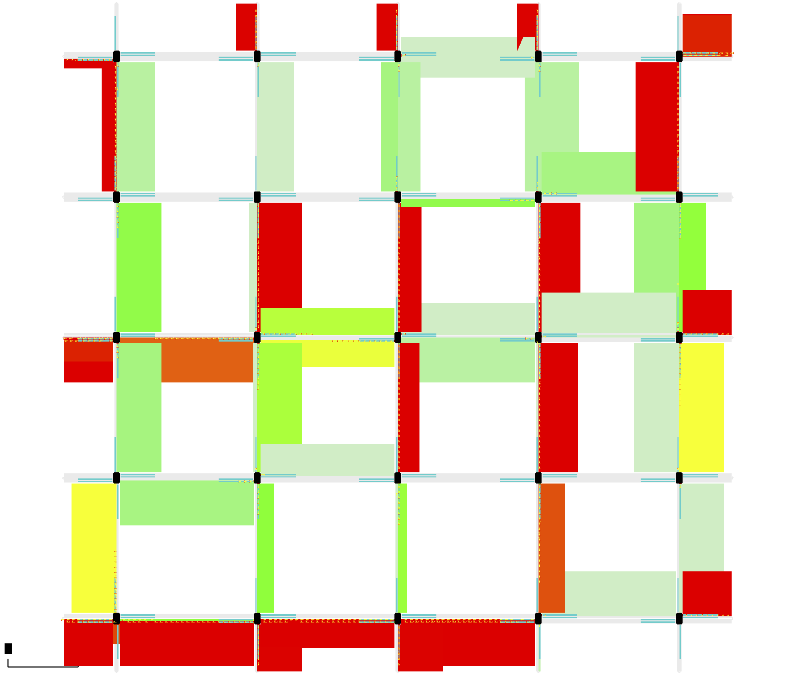
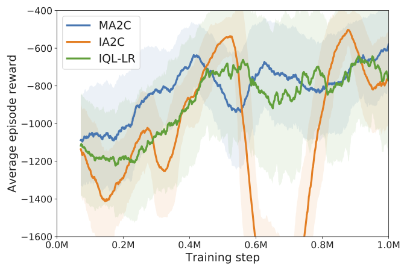
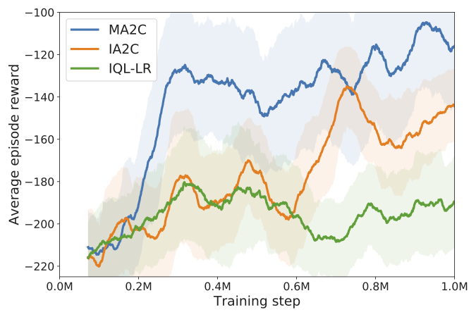

# Deep RL for traffic signal control

This repo implements start-of-the-art mutli-agent (decentralized) deep RL algorithms for large-scale traffic signal control in SUMO-simulated environments.

Available cooperation levels:
* Centralized: a global agent that makes global control w/ global observation, reward.
* Decentralized: multiple local agents that make local control independently w/ neighborhood information sharing.

Available NN layers:
Fully-connected, LSTM.

Available algorithms:
IQL, IA2C, IA2C with stabilization (called MA2C in this paper). For more advanced algorithms, please check [deeprl_network](https://github.com/cts198859/deeprl_network). 

Available environments:
* A 6-intersection benchmark traffic network. [Ye, Bao-Lin, et al. "A hierarchical model predictive control approach for signal splits optimization in large-scale urban road networks." IEEE Transactions on Intelligent Transportation Systems 17.8 (2016): 2182-2192.](https://ieeexplore.ieee.org/abstract/document/7406703/)
* A 5X5 traffic grid. [Chu, Tianshu, Shuhui Qu, and Jie Wang. "Large-scale traffic grid signal control with regional reinforcement learning." American Control Conference (ACC), 2016. IEEE, 2016.](https://ieeexplore.ieee.org/abstract/document/7525014/)
* A modified Monaco traffic network with 30 signalized intersections. [L. Codeca, J. Härri, "Monaco SUMO Traffic (MoST) Scenario: A 3D Mobility Scenario for Cooperative ITS" SUMO 2018, SUMO User Conference, Simulating Autonomous and Intermodal Transport Systems May 14-16, 2018, Berlin, Germany.](http://www.eurecom.fr/en/publication/5527/download/comsys-publi-5527.pdf) ([code](https://github.com/lcodeca/MoSTScenario))

## Requirements
* Python3==3.5
* [Tensorflow](http://www.tensorflow.org/install)==1.12.0
* [SUMO](http://sumo.dlr.de/wiki/Installing)>=1.1.0

Required packages can be installed by running `setup_mac.sh` or `setup_ubuntu.sh`. 

Attention: the code on master branch is for SUMO version >= 1.1.0. Please go to branch [sumo-0.32.0](https://github.com/cts198859/deeprl_signal_control/tree/sumo-0.32.0) if you are using the old SUMO version.

## Usages
First define all hyperparameters in a config file under `[config_dir]`, and create the base directory of experiements `[base_dir]`. Before training, please call `build_file.py` under `[environment_dir]/data/` to generate SUMO network files for `small_grid` and `large_grid` environments.

1. To train a new agent, run
~~~
python3 main.py --base-dir [base_dir]/[agent] train --config-dir [config_dir] --test-mode no_test
~~~
`[agent]` is from `{ia2c, ma2c, iqll, iqld}`. `no_test` is suggested, since tests will significantly slow down the training speed.

2. To access tensorboard during training, run
~~~
tensorboard --logdir=[base_dir]/log
~~~

3. To evaluate and compare trained agents, run
~~~
python3 main.py --base-dir [base_dir] evaluate --agents [agents] --evaluation-seeds [seeds]
~~~
Evaluation data will be output to `[base_dir]/eva_data`, and make sure evaluation seeds are different from those used in training. Under default evaluation setting, the inference policy of A2C is stochastic whereas that of Q-learning is greedy (deterministic). To explicitly specifiy the inference policy type, pass argument `--evaluation-policy-type [default/stochastic/deterministic]`. Please note running a determinisitc inference policy for A2C may cause the performance loss, due to the violation of "on-policy" learning.   

4. To visualize the agent behavior, run
~~~
python3 main.py --base-dir [base_dir] evaluate --agents [agent] --evaluation-seeds [seed] --demo
~~~
It is recommended to have only one agent and one evaluation seed for the demo run. This will launch the SUMO GUI, and `./large_grid/data/view.xml` can be applied to visualize queue length and intersectin delay in edge color and thickness. Below are a few example screenshots.

|   t=1500s          |      t=2500s         |     t=3500s              
:-------------------:|:--------------------:|:--------------------:
 |  |  

## Reproducibility
Due to SUMO version change and a few corresponding code modifications (e.g. `tau="0.5"` has to be removed from `vType` to prevent extensive vehicle collisions in simulation), it becomes difficult to reproduce paper results, which are based on SUMO 0.32.0. So we have re-run the experiments using SUMO 1.1.0 and provided the following training plots as reference. The conclusion still remains the same, that is, MA2C ~ IQL-LR > IA2C in large grid and MA2C > IA2C > IQL-LR in Monaco net. Note rather than reproducing exactly the same results, an evaluation is always valid as far as the comparison is fair, that is, fixing env config and seed across agents. 

|   large grid                   |      Monaco net                   
:-------------------------------:|:------------------------------:
 |        

## Citation
If you find this useful in your research, please cite our paper "Multi-Agent Deep Reinforcement Learning for Large-Scale Traffic Signal Control" ([early access version](https://ieeexplore.ieee.org/document/8667868), [preprint version](https://arxiv.org/pdf/1903.04527.pdf)):
~~~
@article{chu2019multi,
  title={Multi-Agent Deep Reinforcement Learning for Large-Scale Traffic Signal Control},
  author={Chu, Tianshu and Wang, Jie and Codec{\`a}, Lara and Li, Zhaojian},
  journal={IEEE Transactions on Intelligent Transportation Systems},
  year={2019},
  publisher={IEEE}
}
~~~
